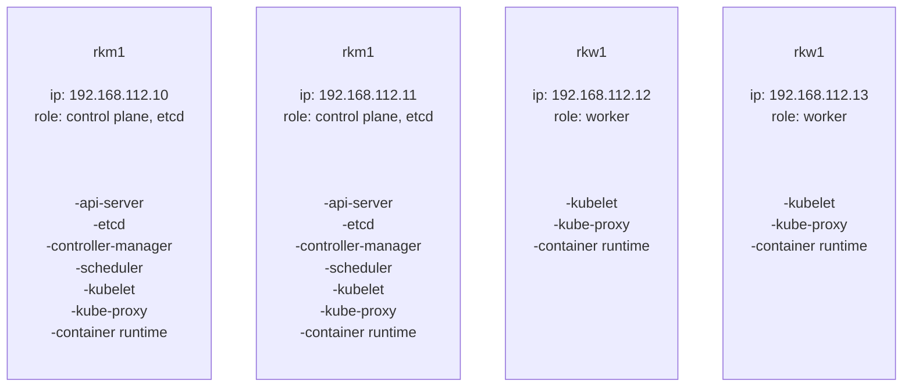
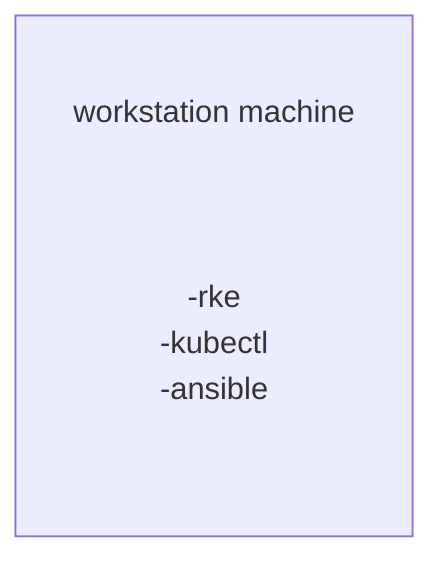

## Setup kubernetes cluster with RKE


### Prepare workstation machine

1- Install kubectl

```bash
curl -LO https://storage.googleapis.com/kubernetes-release/release/`curl -s https://storage.googleapis.com/kubernetes-release/release/stable.txt`/bin/linux/amd64/kubectl
chmod +x ./kubectl
sudo mv ./kubectl /usr/local/bin/kubectl
kubectl version --client
```

2- Install rke Binary

```bash
curl -s https://api.github.com/repos/rancher/rke/releases/latest | grep download_url | grep linux-amd64 | cut -d '"' -f 4 | wget -i -
chmod +x rke_linux-amd64
sudo mv rke_linux-amd64 /usr/local/bin/rke
rke --version
```

3- Install ansible

```bash
apt update
apt install software-properties-common
add-apt-repository --yes --update ppa:ansible/ansible
apt install ansible

ansible --version
```

4- Generate SSH key pair

```bash
ssh-keygen
```

### Prepare cluster nodes

#### We have 

- Two master nodes that have control plane and etcd role
- Two worker nodes


#### VM hardware specification

- Master nodes -- 8GB RAM and 4 vCPU  -- Ubuntu 22.04 LTS
- Worker nodes -- 16GB RAM and 8 vCPU -- Ubuntu 22.04 LTS


#### Nodes hostname and IP address

- rkm1 (192.168.112.10)
- rkm1 (192.168.112.11)
- rkw1 (192.168.112.12)
- rkw2 (192.168.112.13)






### Step 1: Update all nodes

```bash
sudo apt-get update
sudo apt-get upgrade
```

### Step 2: Create rke user with passwordless sudo

#### Using Ansible Playbook

```bash
---
- name: Create rke user with passwordless sudo
  hosts: k8s-hosts
  tasks:
    - name: Add rke user
      user:
        name: rke
        shell: /bin/bash
     
    - name: Create sudo file
      file:
        path: /etc/sudoers.d/rke
        state: touch
    
    - name: Give rke user passwordless sudo
      lineinfile:
        path: /etc/sudoers.d/rke
        state: present
        line: 'rke ALL=(ALL:ALL) NOPASSWD: ALL'
     
    - name: Set authorized key taken from file
      authorized_key:
        user: rke
        state: present
        key: "{{ lookup('file', '~/.ssh/id_rsa.pub') }}"
```


#### Run Ansible Playbook

```bash
ansible-playbook -i inventory rke-user.yaml
```

#### Manual way

1- Create rke user

```bash
sudo useradd -m rke
sudo passwd rke
sudo usermod -s /bin/bash rke
```
2- Enable passwordless sudo for the rke user

```bash
sudo vim /etc/sudoers.d/rke
rke  ALL=(ALL:ALL) NOPASSWD: ALL
```

3- Copy your ssh public key to the user’s ~/.ssh/authorized_keys file

```bash
for i in rkm1 rkm2 rkw1 rkw2; do
  ssh-copy-id rke@$i
done
```

### Step 3: Enable required Kernel modules

#### Using Ansible Playbook

```bash
---
- name: Load RKE kernel modules
  hosts: k8s-hosts
  vars:
    kernel_modules:
      - overlay
      - br_netfilter

  tasks:
    - name: Load kernel modules for RKE
      modprobe:
        name: "{{ item }}"
        state: present
      with_items: "{{ kernel_modules }}"
```

#### Run Ansible Playbook

```bash
ansible-playbook -i inventory kernel-module.yaml
```

#### Manual way

```bash
for module in overlay br_netfilter;
     do
       if ! lsmod | grep -q $module; then
         echo "module $module is not present";
         sudo modprobe $module
       fi;
done
```

### Step 4: Disable swap and modify sysctl entries

#### Using Ansible Playbook:

```bash
---
- name: Disable swap and modify sysctl entries
  hosts: k8s-hosts
  tasks:
    - name: Disable SWAP since kubernetes can't work with swap enabled (1/2)
      shell: |
        swapoff -a
     
    - name: Disable SWAP in fstab since kubernetes can't work with swap enabled (2/2)
      replace:
        path: /etc/fstab
        regexp: '^([^#].*?\sswap\s+.*)$'
        replace: '# \1'
    - name: Modify sysctl entries
      sysctl:
        name: '{{ item.key }}'
        value: '{{ item.value }}'
        sysctl_set: yes
        state: present
        reload: yes
      with_items:
        - {key: net.bridge.bridge-nf-call-ip6tables, value: 1}
        - {key: net.bridge.bridge-nf-call-iptables,  value: 1}
        - {key: net.ipv4.ip_forward,  value: 1}
```

#### Run Ansible Playbook

```bash
ansible-playbook -i inventory swap-sysctl.yaml
```


#### Manual way

1- Disable swap:

```bash
sudo vim /etc/fstab
# Add comment to swap line

sudo swapoff -a
```

2- Modify sysctl:

```bash
sudo tee -a /etc/sysctl.d/99-kubernetes.conf <<EOF
net.bridge.bridge-nf-call-iptables  = 1
net.ipv4.ip_forward                 = 1
net.bridge.bridge-nf-call-ip6tables = 1
EOF

sudo sysctl --system
```

### Step 5: Install Docker CE

#### Using Ansible Playbook:

```bash
---
- hosts: k8s-hosts
  become: yes
  vars:
    ansible_user: rke
  tasks:

    - name: Update apt cache
      apt: update_cache=yes cache_valid_time=3600

    - name: Upgrade all apt packages
      apt: upgrade=dist

    - name: Install dependencies
      apt:
        name: "{{ packages }}"
        state: present
        update_cache: yes
      vars:
        packages:
        - apt-transport-https
        - ca-certificates
        - curl
        - software-properties-common
        - gnupg-agent
      
    - name: Add an apt signing key for Docker
      apt_key:
        url: https://download.docker.com/linux/ubuntu/gpg
        state: present

    - name: Add apt repository for stable version
      apt_repository:
        repo: deb [arch=amd64] https://download.docker.com/linux/ubuntu jammy stable
        state: present

    - name: Install Docker
      apt:
        name: "{{ packages }}"
        state: present
        update_cache: yes
      vars:
        packages:
        - docker-ce
        - docker-ce-cli 
        - containerd.io

    - name: Add rke user to docker group
      user:
        name: "{{ ansible_user }}"
        group: docker
        append: yes
```

#### Run Ansible Playbook

```bash
ansible-playbook -i inventory install-docker.yaml
```

#### Using Docker script:

```bash
curl -fsSL get.docker.com -o get-docker.sh
sudo sh get-docker.sh
```

#### Using Rancher script:

```bash
curl https://releases.rancher.com/install-docker/20.10.sh | sudo bash -
```


### Step 7: Collect and publish images to your private registry (*Optional*)


1- Modify rancher-images.txt file with your rke version 

```bash
rke config --system-images --all --list-version | grep -v time > rancher-images.txt
```

2- Run rancher-save-images.sh with the rancher-images.txt image list to create a tarball of all the required images

```bash
./rancher-save-images.sh --image-list ./rancher-images.txt
```

3- Log into your private registry if required

```bash
docker login registry.omdgrp.ir
```

4- Use rancher-load-images.sh to extract, tag and push rancher-images.txt and rancher-images.tar.gz to your private registry

```bash
./rancher-load-images.sh --image-list ./rancher-images.txt --registry registry.omdgrp.ir
```


### Step 8: Generate rke cluster configuration file

```bash
rke config --empty --name cluster.yml
```


### Step 9: Modify cluster.yml file according to your desired state

```bash
# If you intended to deploy Kubernetes in an air-gapped environment,
# please consult the documentation on how to configure custom RKE images.
nodes:
- address: 192.168.112.10
  port: "22"
  internal_address: ""
  role:
  - controlplane
  - etcd
  hostname_override: "rkm1"
  user: rke
  docker_socket: /var/run/docker.sock
  ssh_key: ""
  ssh_key_path: "" 
  ssh_cert: ""
  ssh_cert_path: ""
  labels: {}
  taints: []
- address: 192.168.112.11
  port: "22"
  internal_address: ""
  role:
  - controlplane
  - etcd
  hostname_override: "rkm2"
  user: rke
  docker_socket: /var/run/docker.sock
  ssh_key: ""
  ssh_key_path: 
  ssh_cert: ""
  ssh_cert_path: ""
  labels: {}
  taints: []
- address: 192.168.112.12
  port: "22"
  internal_address: ""
  role:
  - worker
  hostname_override: "rkw1"
  user: rke
  docker_socket: /var/run/docker.sock
  ssh_key: ""
  ssh_key_path: 
  ssh_cert: ""
  ssh_cert_path: ""
  labels: {}
  taints: []
- address: 192.168.112.13
  port: "22"
  internal_address: ""
  role:
  - worker
  hostname_override: "rkw2"
  user: rke
  docker_socket: /var/run/docker.sock
  ssh_key: ""
  ssh_key_path: 
  ssh_cert: ""
  ssh_cert_path: ""
  labels: {}
  taints: []
services:
  etcd:
    image: ""
    extra_args: {}
    extra_binds: []
    extra_env: []
    win_extra_args: {}
    win_extra_binds: []
    win_extra_env: []
    external_urls: []
    ca_cert: ""
    cert: ""
    key: ""
    path: ""
    uid: 0
    gid: 0
    snapshot: null
    retention: ""
    creation: ""
    backup_config: null
  kube-api:
    image: ""
    extra_args: {}
    extra_binds: []
    extra_env: []
    win_extra_args: {}
    win_extra_binds: []
    win_extra_env: []
    service_cluster_ip_range: 10.43.0.0/16
    service_node_port_range: ""
    pod_security_policy: false
    always_pull_images: false
    secrets_encryption_config: null
    audit_log: null
    admission_configuration: null
    event_rate_limit: null
  kube-controller:
    image: ""
    extra_args: {}
    extra_binds: []
    extra_env: []
    win_extra_args: {}
    win_extra_binds: []
    win_extra_env: []
    cluster_cidr: 10.42.0.0/16
    service_cluster_ip_range: 10.43.0.0/16
  scheduler:
    image: ""
    extra_args: {}
    extra_binds: []
    extra_env: []
    win_extra_args: {}
    win_extra_binds: []
    win_extra_env: []
  kubelet:
    image: ""
    extra_args: {}
    extra_binds: []
    extra_env: []
    win_extra_args: {}
    win_extra_binds: []
    win_extra_env: []
    cluster_domain: cluster.local
    infra_container_image: ""
    cluster_dns_server: 10.43.0.10
    fail_swap_on: false
    generate_serving_certificate: false
  kubeproxy:
    image: ""
    extra_args: {}
    extra_binds: []
    extra_env: []
    win_extra_args: {}
    win_extra_binds: []
    win_extra_env: []
network:
  plugin: calico
  options: {}
  mtu: 0
  node_selector: {}
  update_strategy: null
  tolerations: []
authentication:
  strategy: x509
  sans: []
  webhook: null
addons: ""
addons_include: []
system_images:
  etcd: 
  alpine: 
  nginx_proxy: 
  cert_downloader: 
  kubernetes_services_sidecar: 
  kubedns: 
  dnsmasq: 
  kubedns_sidecar: 
  kubedns_autoscaler: 
  coredns: 
  coredns_autoscaler: 
  nodelocal: 
  kubernetes: 
  flannel: 
  flannel_cni: 
  calico_node: 
  calico_cni: 
  calico_controllers: 
  calico_ctl: 
  calico_flexvol: 
  canal_node: 
  canal_cni: 
  canal_controllers: 
  canal_flannel: 
  canal_flexvol: 
  weave_node: 
  weave_cni: 
  pod_infra_container: 
  ingress: 
  ingress_backend: 
  ingress_webhook: 
  metrics_server: 
  windows_pod_infra_container: 
  aci_cni_deploy_container: 
  aci_host_container: 
  aci_opflex_container: 
  aci_mcast_container: 
  aci_ovs_container: 
  aci_controller_container: 
  aci_gbp_server_container: 
  aci_opflex_server_container: 
ssh_key_path: ~/.ssh/id_rsa
ssh_cert_path: ""
ssh_agent_auth: false
authorization:
  mode: rbac
  options: {}
ignore_docker_version: null
enable_cri_dockerd: null
kubernetes_version: "v1.22.5-rancher1-1"
private_registries: []
ingress:
  provider: ""
  options: {}
  node_selector: {}
  extra_args: {}
  dns_policy: ""
  extra_envs: []
  extra_volumes: []
  extra_volume_mounts: []
  update_strategy: null
  http_port: 0
  https_port: 0
  network_mode: ""
  tolerations: []
  default_backend: null
  default_http_backend_priority_class_name: ""
  nginx_ingress_controller_priority_class_name: ""
  default_ingress_class: null
cluster_name: "hq-rke-cluster-1"
cloud_provider:
prefix_path: ""
win_prefix_path: ""
addon_job_timeout: 0
bastion_host:
  address: ""
  port: ""
  user: ""
  ssh_key: ""
  ssh_key_path: ""
  ssh_cert: ""
  ssh_cert_path: ""
  ignore_proxy_env_vars: false
monitoring:
  provider: ""
  options: {}
  node_selector: {}
  update_strategy: null
  replicas: null
  tolerations: []
  metrics_server_priority_class_name: ""
restore:
  restore: false
  snapshot_name: ""
rotate_encryption_key: false
dns: null
```

### Step 10: Deploy cluster

```bash
rke up
```

### Step 11: Accessing your cluster

```bash
export KUBECONFIG=$PWD/kube_config_cluster.yml
kubectl get nodes
```


### References

- https://rancher.com/products/rke
- https://github.com/rancher/rke
